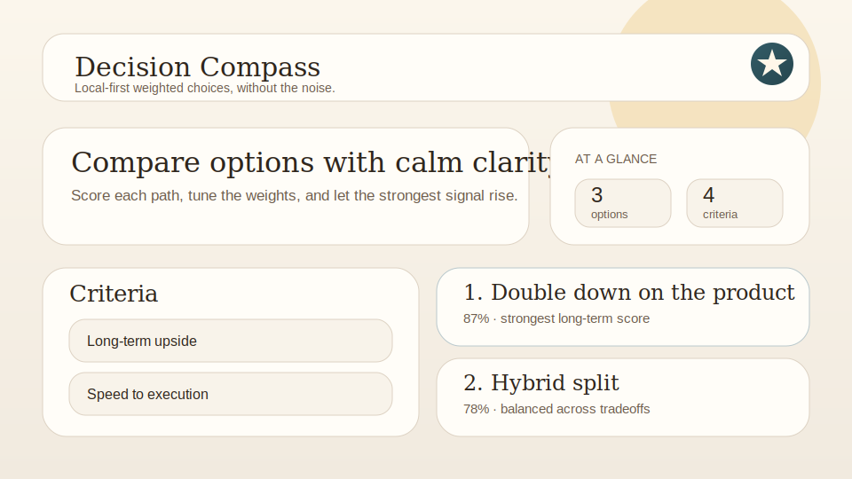

# Decision Compass

A calm local-first decision matrix for comparing options with weighted criteria.



Decision Compass helps you think clearly when you're choosing between offers, tools, strategies, vendors, or next steps. Add your options, define the criteria that matter, assign weights, and let the scorecard show which direction is strongest.

## Features

- Weighted decision matrix with live ranking
- Criteria editor with adjustable weights
- Option cards with notes and per-criterion scores
- Confidence and best-choice summary at the top
- Thoughtful first-run sample matrix
- Import and export JSON backups
- Keyboard shortcuts and lightweight toast feedback
- Local-first persistence via `localStorage`
- No accounts, no tracking, no backend

## Quick start

```bash
git clone https://github.com/<you>/decision-compass.git
cd decision-compass
python -m http.server 8000
```

Then open <http://localhost:8000>.

You can also open `index.html` directly in a modern browser. There is no build step.

## Shortcuts

- `N` new decision
- `C` add criterion
- `O` add option
- `E` export backup
- `I` import backup
- `?` show shortcut help

## Data model

Decision Compass stores plain JSON in the browser:

```json
{
  "decisionTitle": "Which next move should I take this quarter?",
  "note": "A sample matrix comparing realistic paths with weighted tradeoffs.",
  "criteria": [
    { "id": "crit_upside", "label": "Long-term upside", "weight": 9 }
  ],
  "options": [
    { "id": "opt_product", "name": "Double down on the product", "note": "Higher upside, slower validation." }
  ],
  "scores": {
    "opt_product": { "crit_upside": 10 }
  }
}
```

## Project structure

```text
decision-compass/
  index.html
  styles/
    tokens.css
    app.css
    matrix.css
  js/
    main.js
    model.js
    store.js
    ui.js
    seeds.js
    io.js
    feedback.js
    shortcuts.js
  docs/
    preview.svg
```

## Privacy

Everything stays in your browser unless you explicitly export a backup. Decision Compass never makes a network request.

## License

MIT
